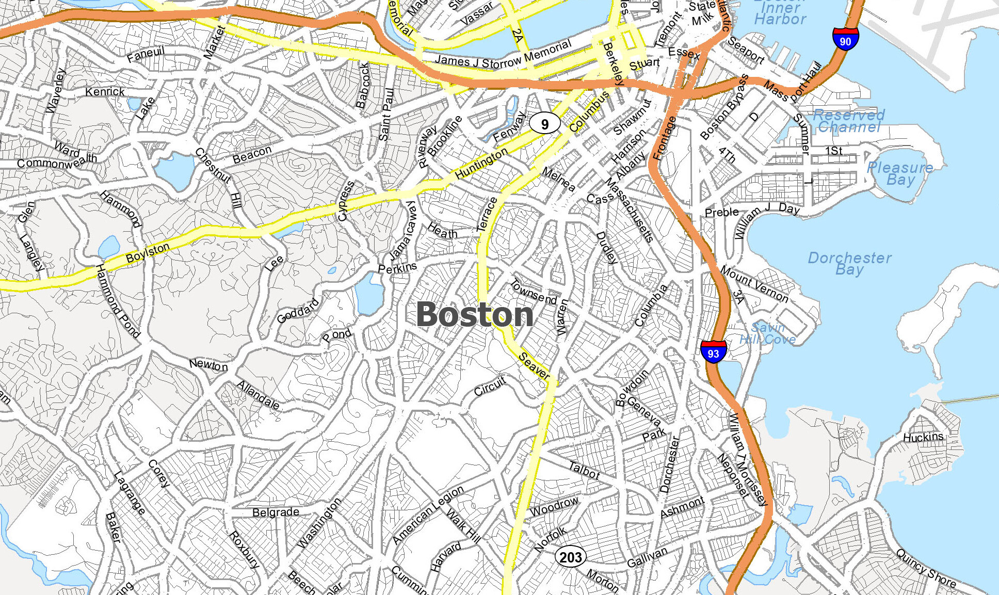

<!DOCTYPE html>
<html  lang="en">

<head>
    <meta charset="utf-8">
    <meta http-equiv="X-UA-Compatible" content="IE=edge">
    <meta name="viewport" content="width=device-width, initial-scale=1">
    <title>My Portfolio</title>
    <link rel="stylesheet" href="./css/style.css">
    <!-- Google Fonts -->
    <link rel="preconnect" href="https://fonts.googleapis.com">
    <link rel="preconnect" href="https://fonts.gstatic.com" crossorigin>
    <!-- Font Awesome -->
    <link href="https://fonts.googleapis.com/css2?family=Montserrat&family=Ubuntu&display=swap" rel="stylesheet">
    

</head>

    <header>
        
        <ul id="menu" class="shadow">
            <li>
                <a href="#about">About</a>
            </li>
           
            <li>
                <a href="#projects">Projects</a>
            </li>
           
            <li>
                <a href="#contact">Contact</a>
            </li>
        </ul>
    </header>
    <!-- End header -->

    

        

            <h1>Shreya Patel</h1>
            <h2>Account's Payble</h2>
            <a href="https://docs.google.com/document/d/1HuCfM4NrSC1YOqS_zp_HLjgym_KmAxfK/edit" class="btn-rounded-white"> My Resume</a>
        

        <!-- End #lead-content -->

        

        

            
                <i class="fa fa-chevron-down" aria-hidden="true"></i>
            
        

        <!-- End #lead-down -->
    

    <!-- End #lead -->

    

        

            

                

                    <h2 class="heading">About Me</h2>
                

                

                    

                        Hi, My name is Shreya Patel. Currently, I live in Boston, Massachusetts.
                        I am working as an Account Payable in ISG. I want to develop my still in Coding, and for that, I am taking an online course at MIT.   
                    

                

            

        

    

    <!-- End #about -->

   
    

        <h2 class="heading">Projects</h2>
        

            

                

                    

                        
                        
                    

                    <!-- End .project-image -->
                    

                        <h3>PacMan</h3>
                        

                            In this Exercise i have creact Pacman which move against the edge of the Window.
                        

                        <a href="https://github.com/shreya1p/Pacman" target="_blank">Click Link</a>
                    

                    <!-- End .project-info -->
                

                <!-- End .project -->

               
               
                

                    

                        
                    
                    

                    <!-- End .project-image -->
                    

                        <h3>Bus-Tracker</h3>
                        

                            In this exarcise i have create a map who tracks a Bus route.   
                        

                        <a href="https://github.com/shreya1p/Bus-Tracker/"target="_blank">Click Link</a>
                    

                    <!-- End .project-info -->
                

                <!-- End .project -->
           
           
            

            

                

                    
                

                <!-- End .project-image -->
                

                    <h3>Eye Exarcise</h3>
                    

                        In this Exercises i have make two eyes that move with mouse.  
                    

                    <a href="https://github.com/shreya1p/Eye-exercises/" target="_blank">Click Link</a>
                

                <!-- End .project-info -->
            

            <!-- End .project -->
        

        
    
   
        

            <h2>Get in Touch</h2>
            

                

                
                  
<i class="fa-solid fa-envelope"></i>  shreyapatel67@gmail.com

                  
                </form>
            

            <!-- End #contact-form -->
        

        <!-- End #contact -->
        
        <h2>Social Media</h2>
        
        

          <a href="https://www.linkedin.com/in/shreya-patel-87ba7523b/"><i class="fa-brands fa-linkedin fa-2xl"> Linkdin </i></a>
       

       
    
        

          <a href="https://github.com/shreya1p"><i class="fa-brands fa-github fa-2xl"> Github </i></a>
        

        

            Shreya Patel <i class="fa-solid fa-copyright"></i> COPYRIGHT 2022
          

        </section>
      
        
      </body>
      
      </html>
                    
